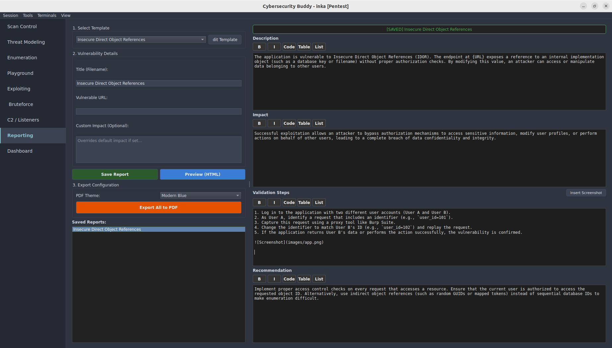

## Description
The application is vulnerable to Insecure Direct Object References (IDOR). The endpoint at http://localhost/idor exposes a reference to an internal implementation object (such as a database key or filename) without proper authorization checks. By modifying this value, an attacker can access or manipulate data belonging to other users.

## Impact
Successful exploitation allows an attacker to bypass authorization mechanisms to access sensitive information, modify user profiles, or perform actions on behalf of other users, leading to a complete breach of data confidentiality and integrity.

## Validation Steps
1. Log in to the application with two different user accounts (User A and User B).
2. As User A, identify a request that includes an identifier (e.g., `user_id=101`).
3. Capture this request using a proxy tool like Burp Suite.
4. Change the identifier to match User B's ID (e.g., `user_id=102`) and replay the request.
5. If the application returns User B's data or performs the action successfully, the vulnerability is confirmed.

## Recommended Fix
Implement proper access control checks on every request that accesses a resource. Ensure that the current user is authorized to access the requested object ID. Alternatively, use indirect object references (such as random GUIDs or mapped tokens) instead of sequential database IDs to make enumeration difficult.
