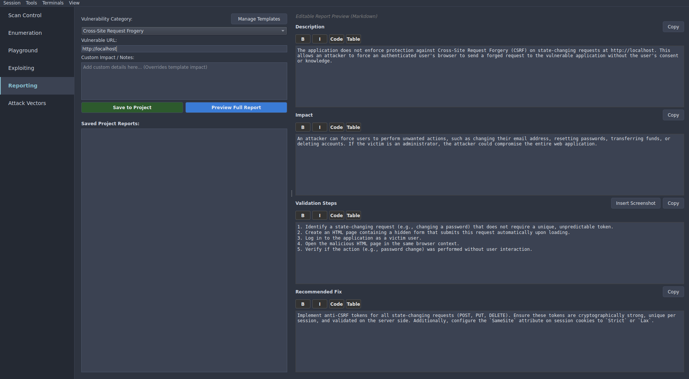

## Description
The application does not enforce protection against Cross-Site Request Forgery (CSRF) on state-changing requests at http://localhost/csrf. This allows an attacker to force an authenticated user's browser to send a forged request to the vulnerable application without the user's consent or knowledge.

## Impact
An attacker can force users to perform unwanted actions, such as changing their email address, resetting passwords, transferring funds, or deleting accounts. If the victim is an administrator, the attacker could compromise the entire web application.

## Validation Steps
1. **Identify** a state-changing request (e.g., changing a password) that does not require a unique, unpredictable token.
2. Create an HTML page containing a hidden form that submits this request automatically upon loading.
3. Log in to the application as a victim user.
4. Open the malicious HTML page in the same browser context.
5. Verify if the action (e.g., password change) was performed without user interaction.

## Fix Recommendation
Implement anti-CSRF tokens for all state-changing requests (POST, PUT, DELETE). Ensure these tokens are cryptographically strong, unique per session, and validated on the server side. Additionally, configure the `SameSite` attribute on session cookies to `Strict` or `Lax`.
