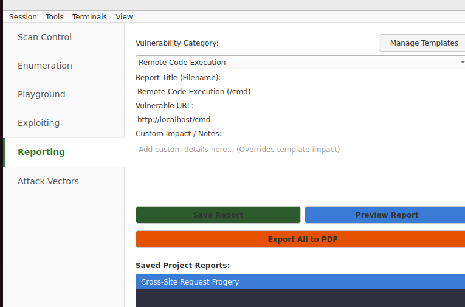

## Description
The application is vulnerable to Remote Code Execution (RCE) at http://localhost/cmd. Due to improper sanitization of user input passed to system shells or code evaluation functions (like `eval()`, `exec()`, or `system()`), an attacker can execute arbitrary system commands on the server.

## Impact
This is a critical vulnerability. It grants the attacker full control over the web server. They can read/write files, install malware, access connected internal networks, and pivot to other systems.

## Validation Steps
1. Identify inputs that appear to interact with the underlying system (e.g., filename processing, image conversion).
2. Inject a benign system command to test for execution, such as `whoami` or `sleep 10`.
3. Observe the response. If the output of `whoami` is displayed or if the response is delayed by the `sleep` command, code execution is confirmed.
4. **Note:** Do not execute destructive commands.

| command| output |
|---|---|
| whoami    | root     | 
| pwd   | /root     | 

## Fix Recommendation
Avoid using functions that execute system commands or evaluate code whenever possible. If unavoidable, use language-specific APIs instead of shell commands. If shell execution is necessary, strictly validate input against a whitelist of allowed characters and ensure arguments are properly quoted and escaped.
